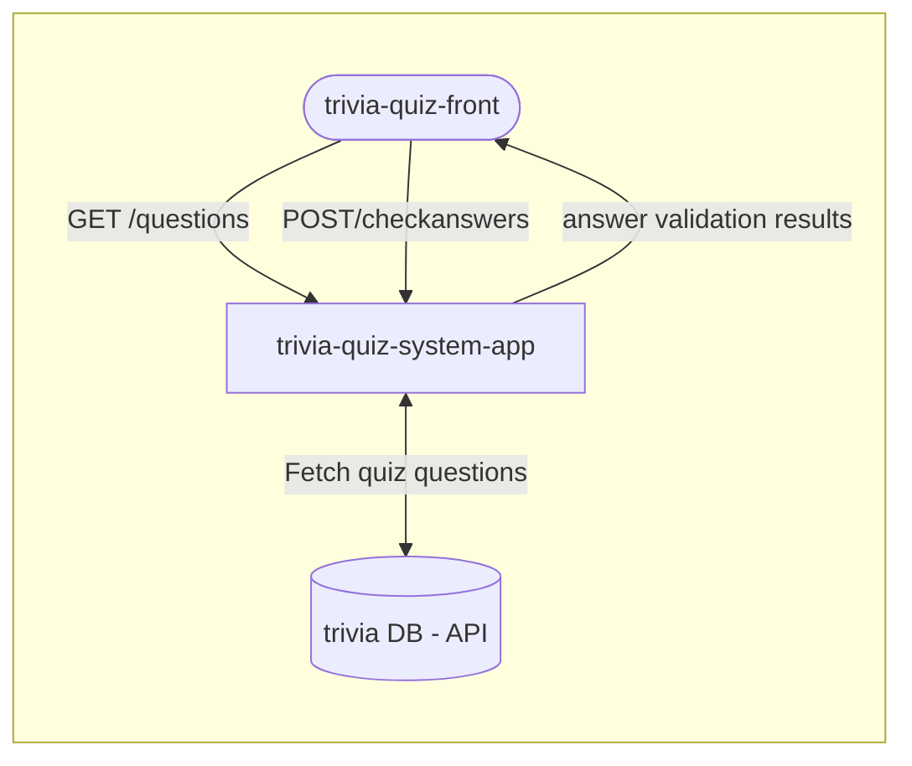
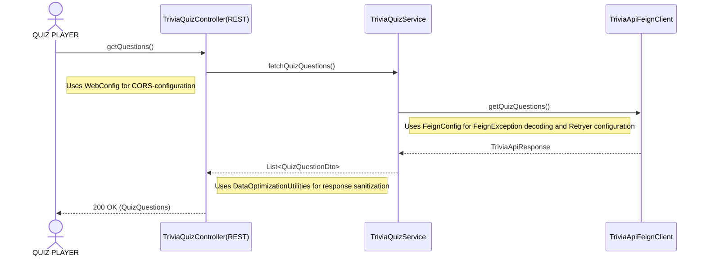
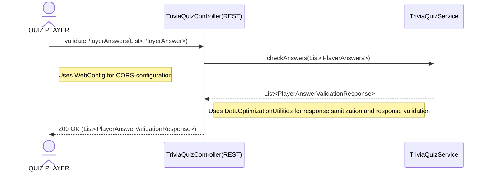

# trivia-quiz-system-app
Backend service for Trivia quiz application 
handling logic in a communication between the frontend and Trivia Quiz Database Api.

❗ **NOTE**: At this moment the application does not provide any quiz customizability and serves players with only 1 quiz variation of 10 questions of random difficulty, categories and types.

## Run application
### Locally
Follow these steps to be able to run application locally:
1. Have jdk-25 and mvn(latest) installed locally OR use EDI's(e.g. `Intellij`) built in options
2. Run `mvn clean install` OR use EDI's `Maven`-plugin to pull and install dependencies
3. Run `TriviaApplication.class` using `localhost`-profile

### Server

[//]: # TODO: Add link to the instance running on a serven when known

## Architecture
*Install `Mermaid`-plugin to view graph(s) properly.*
### High level process visualization

### Process logic visualization
#### Fetch quiz questions - process

#### CheckAnswers - process

